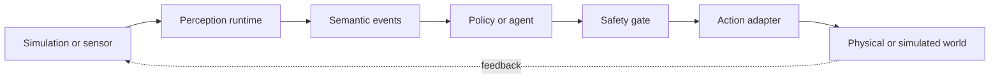
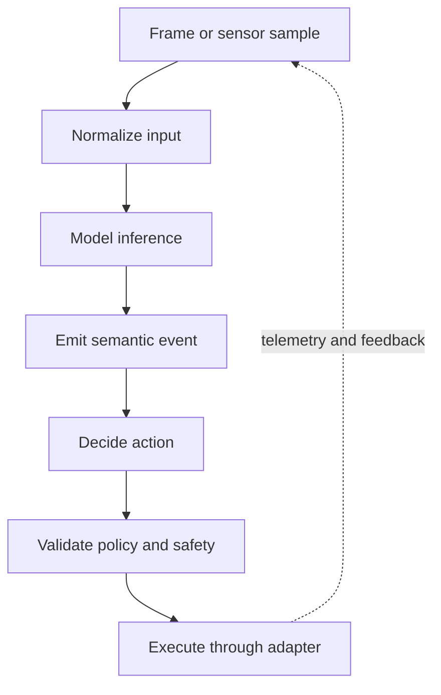

# Architecture

Siqoq is designed around a stable simulation-to-reality path. The same semantic
contracts connect simulation, laptop development and edge hardware; only adapters and
runtime acceleration change.

## System context



The semantic event and action contracts are the stable center of the architecture.
Sensors, transports, inference engines and hardware drivers remain replaceable.

## Core loop



## Layers

### 1. Sensor adapters

Sensor adapters normalize simulated and real inputs behind the same contract.

Initial targets:

- recorded video
- webcam / USB UVC camera
- simulated camera

Later targets:

- CSI camera
- LiDAR
- depth camera
- IMU
- audio

### 2. Inference runtime

The baseline runtime must work on a normal development laptop before any accelerator-specific path is introduced.

Baseline:

- OpenCV
- ONNX Runtime

Accelerated targets:

- TensorRT on NVIDIA Jetson
- CUDA-capable x86 systems
- other ARM/x86 accelerators through adapters where practical

### 3. Semantic event layer

Raw frames should not become the platform API. Inference output should be normalized into semantic events such as:

```json
{
  "type": "object.detected",
  "source": "camera.front",
  "object": "person",
  "confidence": 0.94,
  "timestamp": "..."
}
```

This lets downstream systems consume meaning rather than device-specific frame formats.

### 4. Event transport

Initial transport targets:

- in-process/stdout for local development
- NATS
- MQTT

Transport must remain pluggable.

### 5. Policy / agent layer

Consumers may include deterministic policy engines, local AI agents, or cloud-assisted agents. The infrastructure must not require an LLM to function.

### 6. Action adapters

Actuation is explicitly separated from reasoning. Actions flow through adapters and safety/policy checks before reaching hardware.

Potential targets:

- mock action adapter
- relay/GPIO adapter
- ROS 2 bridge
- motor controller/MCU adapter

### 7. Observability

The full loop should be traceable:

```text
sensor read
  → preprocessing
  → inference
  → semantic event
  → policy decision
  → action request
  → action result
```

OpenTelemetry is the preferred telemetry model, with Prometheus/Grafana-compatible metrics where useful.

## Deployment modes

| Mode | Input | Runtime | Transport | Output |
|---|---|---|---|---|
| Laptop | Recorded media or webcam | CPU baseline | In-process/stdout | Mock or local action |
| Simulation | Isaac Sim or Gazebo | CPU/GPU as available | Pluggable event bus | Virtual actuator |
| Edge | Physical sensors | ONNX or accelerator adapter | NATS/MQTT/local | Hardware adapter |
| Fleet (planned) | Multiple edge nodes | Declarative workloads | Managed messaging | GitOps-managed adapters |

### Laptop mode

For development without special hardware.

```text
macOS/Linux
  ├─ recorded media/webcam
  ├─ local inference
  ├─ local event bus
  └─ local observability
```

### Simulation mode

```text
Isaac Sim / Gazebo
  ↓ virtual sensor adapters
Siqoq runtime
  ↓
semantic events / actions
```

### Edge mode

```text
Jetson / ARM / x86
  ├─ real sensors
  ├─ accelerated inference
  ├─ edge event bus
  └─ telemetry
```

### Fleet mode

Longer-term mode using declarative configuration, container registries, GitOps, and optional Kubernetes/K3s management.

## Non-goals

Siqoq is not intended to replace:

- ROS 2
- Isaac Sim / Gazebo
- model training frameworks
- Kubernetes
- model registries
- robot hardware SDKs

It integrates these where useful and focuses on the simulation-to-edge infrastructure and contracts between them.
